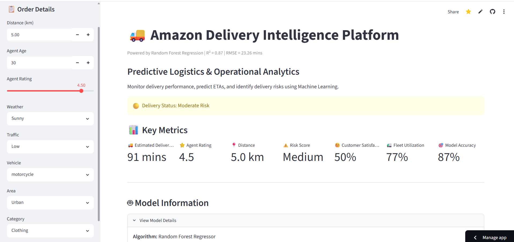
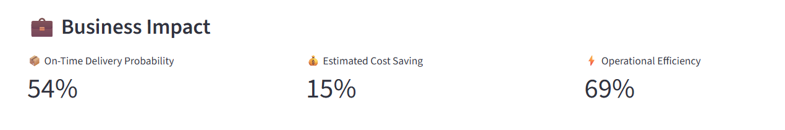
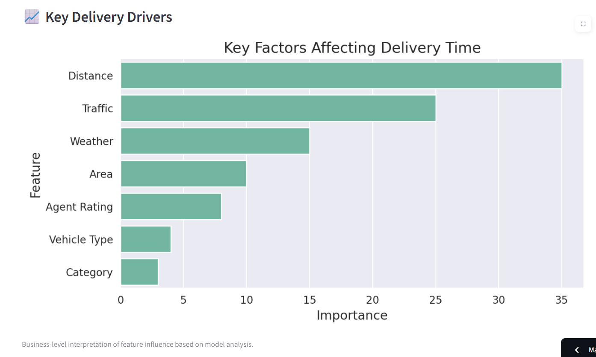
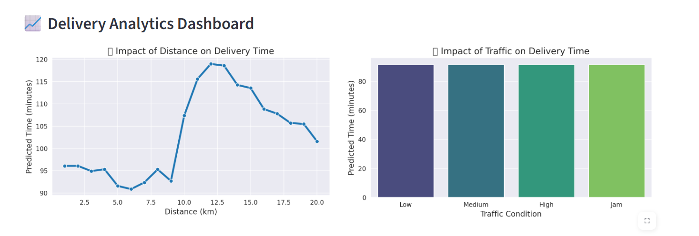
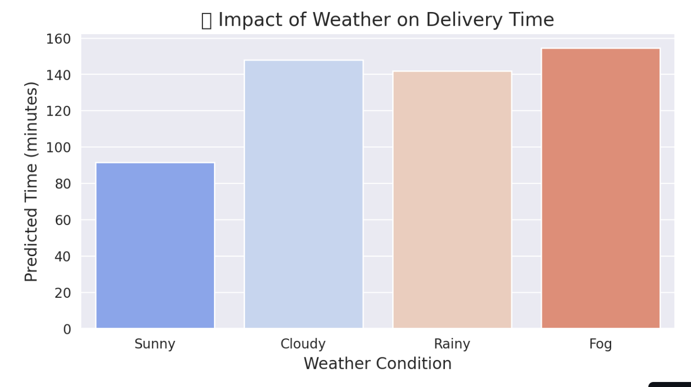

# 🚚 Amazon Delivery Intelligence Platform

## 🌐 Live Demo

🔗 **Streamlit Application:** https://amazondeliverytimeprediction.streamlit.app/

---

# Executive Summary

The Amazon Delivery Intelligence Platform is a Machine Learning-powered logistics analytics solution designed to predict delivery times and provide operational decision support.

The platform utilizes a Random Forest Regression model trained on operational and environmental delivery factors such as distance, weather conditions, traffic levels, vehicle type, delivery area, product category, and agent performance.

The solution provides:

- Real-time ETA Prediction
- Delivery Risk Assessment
- Business Impact Analysis
- Operational Recommendations
- Delivery Analytics Dashboard

---

# Dashboard Overview



The dashboard enables logistics teams to simulate delivery scenarios and instantly predict expected delivery times while monitoring operational KPIs.

Key capabilities include:

- Estimated Delivery Time Prediction
- Delivery Risk Identification
- Customer Satisfaction Estimation
- Fleet Utilization Monitoring
- Model Performance Tracking

---

# Business Problem

Accurate delivery time estimation is critical for modern logistics and e-commerce operations.

Traditional estimation methods often fail to account for dynamic factors such as:

- Traffic congestion
- Weather conditions
- Delivery distance
- Agent performance
- Delivery area characteristics

This can lead to delayed deliveries, inefficient resource allocation, and reduced customer satisfaction.

The objective of this project is to leverage Machine Learning to provide data-driven delivery time predictions and operational insights.

---

# Dataset Features

| Feature | Description |
|----------|-------------|
| Distance_km | Delivery Distance |
| Agent_Age | Age of Delivery Agent |
| Agent_Rating | Performance Rating |
| Weather | Weather Conditions |
| Traffic | Traffic Density |
| Vehicle | Vehicle Type |
| Area | Delivery Area |
| Category | Product Category |
| Delivery_Time | Target Variable |

---

# Methodology

## Data Preprocessing

The following preprocessing steps were performed:

- Missing Value Handling
- Feature Engineering
- Categorical Encoding
- Data Transformation
- Train-Test Split

---

## Machine Learning Model

### Random Forest Regressor

The Random Forest model was selected as the best-performing regression algorithm.

### Model Performance

| Metric | Value |
|----------|--------|
| R² Score | 0.87 |
| RMSE | 23.26 Minutes |
| Model Type | Regression |

### Interpretation

- The model explains approximately 87% of the variance in delivery times.
- Predictions closely align with actual delivery durations.
- Suitable for logistics planning and operational decision support.

---

# Business Impact Analysis



The dashboard generates operational KPIs to support business decisions:

### Key Metrics

- 📦 On-Time Delivery Probability
- 💰 Estimated Cost Saving
- ⚡ Operational Efficiency

These insights help logistics managers improve resource allocation and delivery planning.

---

# Key Delivery Drivers



Feature importance analysis highlights the most influential variables affecting delivery time predictions.

### Most Important Factors

1. Distance
2. Traffic
3. Weather
4. Area
5. Agent Rating
6. Vehicle Type
7. Product Category

These insights provide business-level interpretability for model predictions.

---

# Delivery Analytics Dashboard



Interactive visualizations allow users to analyze:

### Distance Impact

- Relationship between delivery distance and predicted delivery time.

### Traffic Impact

- Influence of traffic conditions on ETA predictions.

The dashboard enables operational teams to simulate different delivery scenarios and evaluate outcomes.

---

# Weather Impact Analysis



Weather conditions significantly influence delivery performance.

The analysis demonstrates how different weather scenarios affect delivery time predictions and operational efficiency.

---

# Skills Demonstrated

## Machine Learning

- Regression Modeling
- Random Forest Regression
- Feature Engineering
- Model Evaluation
- Predictive Analytics

## Data Analysis

- Exploratory Data Analysis (EDA)
- Data Cleaning
- Data Transformation
- Statistical Analysis

## Data Visualization

- Matplotlib
- Seaborn
- Business Dashboard Design

## Deployment

- Streamlit Deployment
- GitHub Version Control
- Joblib Model Serialization

## Business Analytics

- KPI Development
- Delivery Risk Assessment
- Operational Decision Support
- Logistics Intelligence

---

# Technology Stack

### Programming Language

- Python

### Data Analysis

- Pandas
- NumPy

### Visualization

- Matplotlib
- Seaborn

### Machine Learning

- Scikit-Learn
- XGBoost

### Deployment

- Streamlit

### Version Control

- Git
- GitHub

---

# Project Structure

```text
AmazonDeliveryTimePrediction/
│
├── app.py
├── requirements.txt
├── best_delivery_model.joblib
├── amazon_delivery.csv
├── README.md
│
└── images/
    ├── dashboard_overview.png
    ├── business_impact.png
    ├── feature_importance.png
    ├── analytics_dashboard.png
    └── weather_impact.png
```

# Installation

## Clone Repository

```bash
git clone https://github.com/tonujaramesh/AmazonDeliveryTimePrediction.git
```

## Navigate to Project Folder

```bash
cd AmazonDeliveryTimePrediction
```

## Install Dependencies

```bash
pip install -r requirements.txt
```

## Run Application

```bash
streamlit run app.py
```

---

# Results & Business Recommendations

## Results

- Achieved R² Score of 0.87
- RMSE of 23.26 Minutes
- Real-Time ETA Prediction Capability
- Interactive Business Intelligence Dashboard
- Delivery Risk Assessment Framework

## Recommendations

- Optimize routes during peak traffic periods
- Prioritize high-risk deliveries
- Improve fleet allocation strategies
- Utilize predictive insights for delivery planning

---

# Future Enhancements

Potential future improvements include:

- Real-Time Traffic API Integration
- Route Optimization Engine
- Weather API Integration
- XGBoost & LightGBM Model Comparison
- Geospatial Analytics
- Advanced Delivery Risk Forecasting

---

# Author

## Tonuja Ramesh S

Data Science | Machine Learning | Analytics

GitHub: https://github.com/tonujaramesh

LinkedIn: https://www.linkedin.com/in/tonuja-ramesh-s-38871b299

---

## ⭐ Project Highlights

✅ End-to-End Machine Learning Pipeline

✅ Random Forest Regression Model

✅ R² Score of 0.87

✅ Interactive Streamlit Dashboard

✅ Real-Time ETA Prediction

✅ Business Intelligence Analytics

✅ Deployment on Streamlit Cloud

---

If you found this project useful, consider giving it a ⭐ on GitHub.
